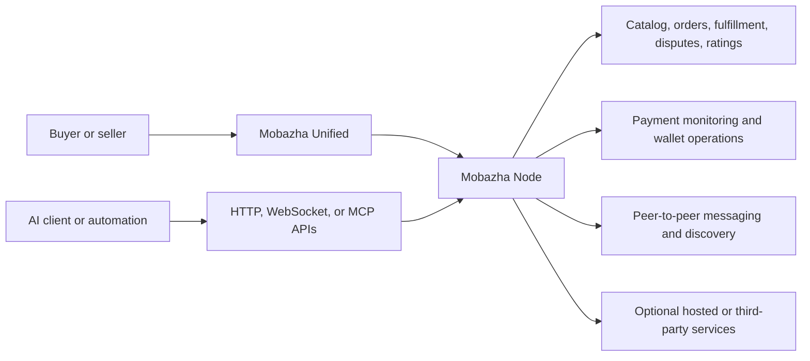
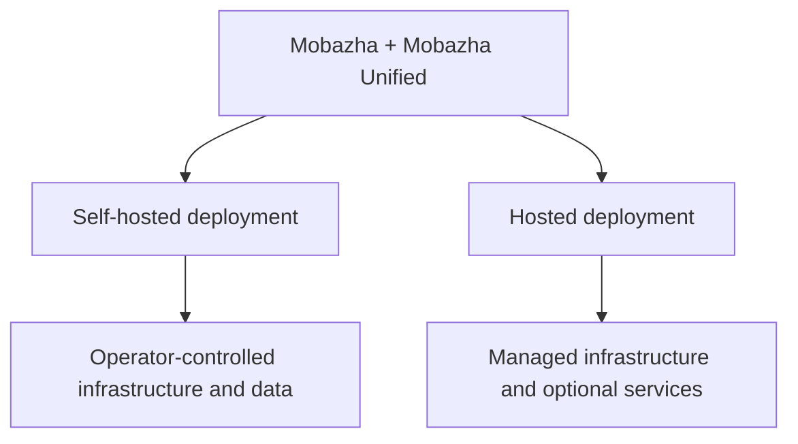

# Architecture Overview

Mobazha has one shared commerce core and supports multiple deployment models.
Self-hosted and hosted deployments are compositions of the same project rather
than separate product tiers.

## Deployment models

A self-hosted node can operate its local store, administration, data export,
and supported payment flows without a hosted Mobazha account. Hosted and other
compatible deployments can add services through explicit capabilities and
integration contracts.

## Backend-authoritative capabilities

The Node is authoritative for available product and payment capabilities.
Mobazha Unified resolves what to display from:

1. the backend runtime-capability response;
2. seller-enabled methods and features;
3. the current user or checkout session; and
4. provider readiness and health where applicable.

The frontend may narrow this set for safety or session validity, but it never
widens the capabilities advertised by the Node.

## Commerce and payment flows

The shared core owns order state, verification, audit, settlement gates, and
key custody. Current demonstrations include a direct BCH payment journey and a
moderated purchase journey. See [Product Demonstrations](../DEMOS.md).

Payment extensions use explicit in-process contracts for reviewed first-party
composition or a versioned out-of-process boundary for independently trusted
plugins. Plugins do not receive raw seed phrases or private keys.

## AI and automation

Mobazha exposes scoped commerce tools through MCP alongside its HTTP and
WebSocket APIs. Client connections require authentication and are constrained
by token scopes, runtime policy, capability availability, and audit controls.
See [AI and Agent Integrations](./AI_AND_AGENTS.md).

## Detailed decisions

- [In-process distribution composition](../adr/016-in-process-distribution-composition.md)
- [Payment plugin boundary](../adr/015-payment-plugin-boundary.md)
- [Mobazha v0.3 payment scope](../adr/017-v0.3-payment-scope.md)
- [Compatibility policy](../project/COMPATIBILITY.md)
