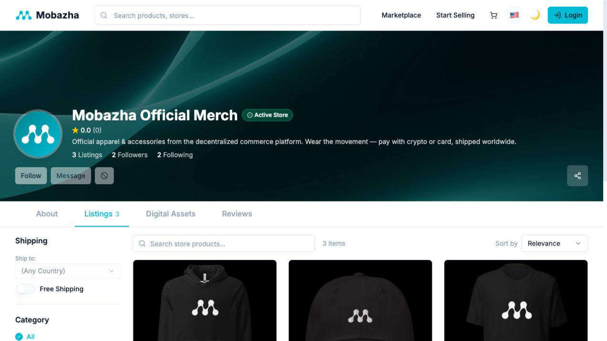

# What is Mobazha?

Mobazha is an open-source commerce platform for storefronts, marketplaces,
checkout, seller operations, and programmable commerce. The same project can
be used through a hosted service or run as a Mobazha Node on infrastructure you
control.

_The Mobazha Official Merch storefront on hosted Mobazha. Mobazha Unified can
also connect to self-hosted Mobazha nodes._

## The main components

| Component | Responsibility |
| --- | --- |
| **Mobazha Node** | Catalog, orders, payments, wallets, messaging, APIs, automation, and local operations |
| **Mobazha Unified** | Storefront, marketplace, checkout, and seller-management interfaces |
| **Hosted Mobazha** | A managed way to use Mobazha without operating the infrastructure yourself |
| **Extensions and integrations** | Payment providers, fulfillment services, AI clients, and other capability-driven integrations |

Mobazha Unified does not assume that every backend has the same capabilities.
The connected backend publishes a versioned capability snapshot, and the
frontend displays only the experiences and payment methods that are currently
available.

## What you can do

- Publish products and operate a storefront.
- Manage checkout, orders, fulfillment, refunds, disputes, and ratings.
- Accept supported wallet-backed payments.
- Run a standalone node or use a hosted deployment.
- Integrate through HTTP, WebSocket, and MCP APIs.
- Connect AI clients and agents to scoped commerce tools exposed by a node.

_Seller operations in a seeded test environment. Data shown here is
demonstration data and does not represent a production account._

## Choose a starting point

- **Try the hosted experience:** visit [app.mobazha.org](https://app.mobazha.org/).
- **Control the deployment and data:** follow the [self-hosting guide](./SELF_HOSTING.md).
- **Build or contribute:** follow the [development guide](./DEVELOPMENT.md).
- **Connect an AI client:** read [AI and agent integrations](../concepts/AI_AND_AGENTS.md).
- **See complete transaction flows:** browse the [product demonstrations](../DEMOS.md).

## Current status

Mobazha v0.3 is a release candidate. The current source build and its default
payment scope are documented and tested, but stable signed binaries and final
production packaging have not yet been published. Use testnet when evaluating
payment flows and expect APIs or setup instructions to change before the first
stable release.
